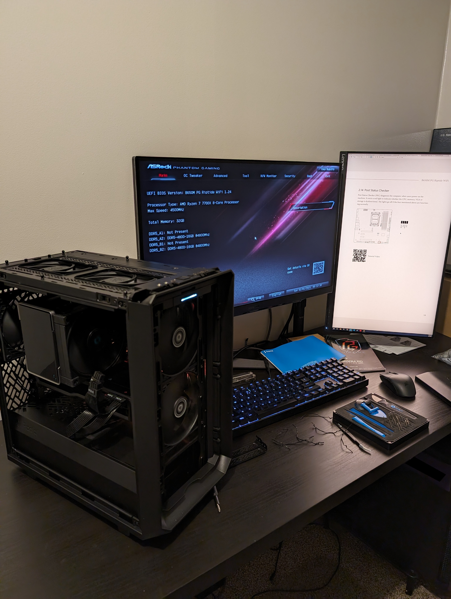
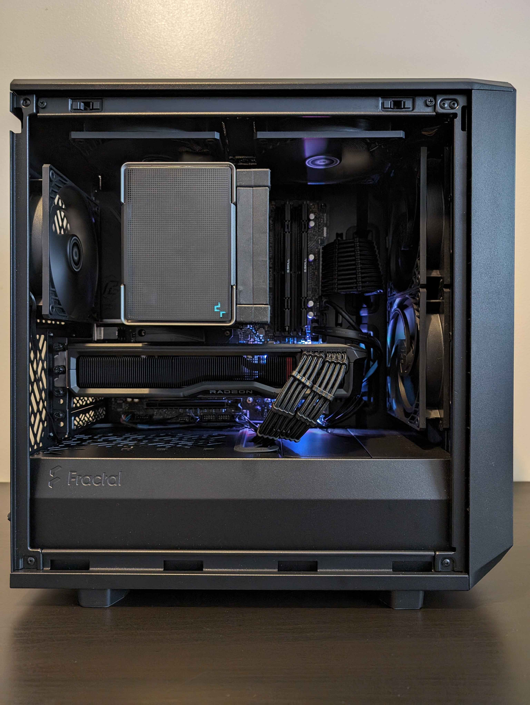
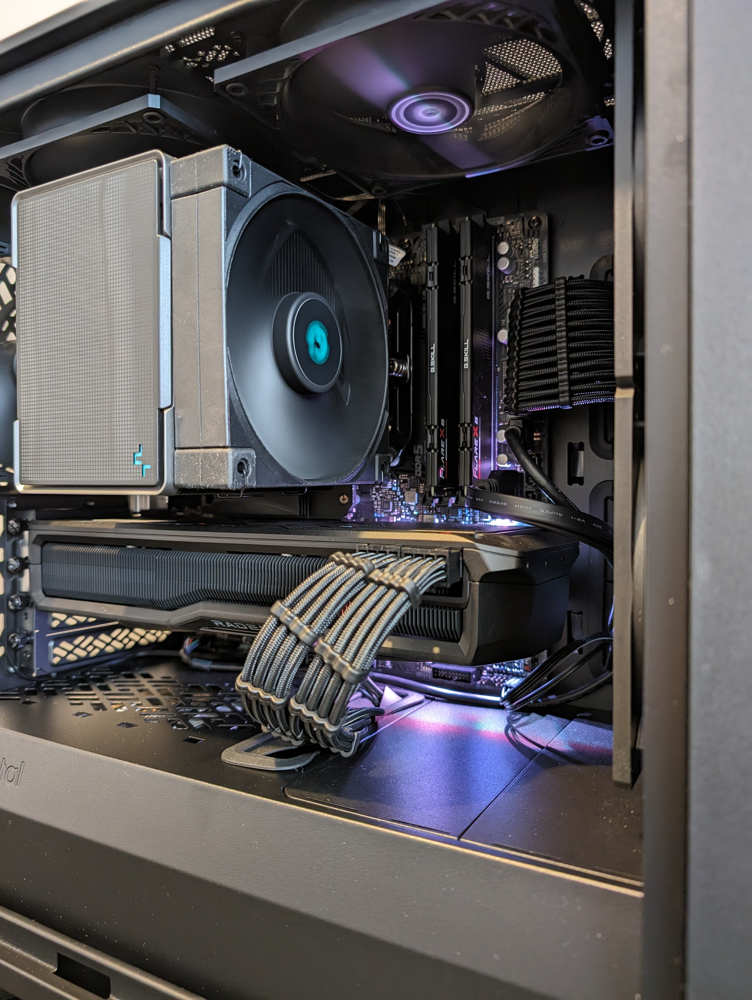
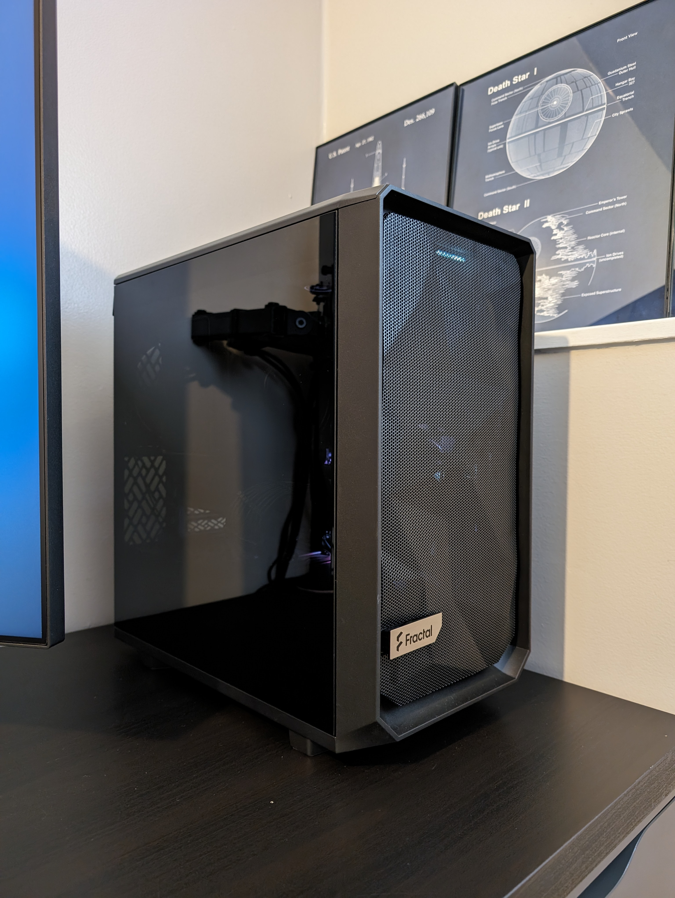

I've been PC user for most of my life. My first experience with computers was in the late 1990s, using MS-DOS and Windows 3.1. It wasn't until I was in college that I was able to build my own PC for the first time. It was a very fun and educational experience for me. Eight years have passed since then, and now it's time to build another PC in 2024. I completed this new build in February this year and have used it for a few months. Here's my experience of picking the parts, building the PC, and thoughts about the process in general. 

TL;DR: [New PC Specs](#2024-pc-components) | [Images](#images)

## The Quarter-Life Crisis PC

First, some background on my previous custom PC.

Back in early 2016, I was a sophomore in college and I was going through what I called my quarter-life crisis. I had just ended a relationship, and I felt a bit down in the dumps. Best solution I had to fix this: spend a lot of money and build a new PC. That became my first PC that I put together, and on a college budget, I feel I did a decent job with the parts I used. I dubbed it the *Quarter-Life Crisis PC* (QLC)^[Apparently I was very dramatic back in 2016.]. Here's a breakdown of that PC:

### QLC Components

Type|Item
:----|:----
**CPU** | [Intel Core i5-4690K 3.5 GHz Quad-Core Processor](https://pcpartpicker.com/product/Tvzv6h/intel-cpu-bx80646i54690k)
**CPU Cooler** | [CRYORIG H7 49 CFM CPU Cooler](https://pcpartpicker.com/product/93Crxr/cryorig-h7-49-cfm-cpu-cooler-h7)
**Motherboard** | [Asus Z87-Pro ATX LGA1150 Motherboard](https://pcpartpicker.com/product/PBMFf7/asus-motherboard-z87pro)
**Memory** | [Kingston HyperX Fury 8 GB (4 x 4 GB) DDR3-1600 CL10 Memory](https://pcpartpicker.com/product/M63RsY/kingston-memory-hx316c10fbk28)
**Storage** | [Samsung 850 Evo 250 GB 2.5" Solid State Drive](https://pcpartpicker.com/product/3kL7YJ/samsung-internal-hard-drive-mz75e250bam)
**Storage** | [Western Digital Caviar Blue 1 TB 3.5" 7200 RPM Internal Hard Drive](https://pcpartpicker.com/product/MwW9TW/western-digital-internal-hard-drive-wd10ezex)
**Video Card** | [Sapphire Dual-X Radeon R9 380 4 GB Video Card](https://pcpartpicker.com/product/hy4NnQ/sapphire-video-card-100384nt4goc2l)
**Case** | [Corsair Carbide Series 200R ATX Mid Tower Case](https://pcpartpicker.com/product/cTQypg/corsair-case-200r)
**Power Supply** | [SeaSonic S12III 550 W 80+ Bronze Certified ATX Power Supply](https://pcpartpicker.com/product/3G97YJ/seasonic-s12iii-550-w-80-bronze-certified-atx-power-supply-ssr-550gb3)

[*PCPartPicker link*](https://pcpartpicker.com/list/ysRJN6)

Total price in 2016 was around $820 (give or take). On a college budget, I think I did pretty good.

I did make a few upgrades since the initial build:

- RAM: doubled from 8 GB to 16 GB
- Storage: added a second 500 GB SSD I had lying around
- PSU: The fan in my original PSU died (it was a Corsair low-tier something or other) so I upgraded to a SeaSonic PSU
- Monitor: upgraded from a basic 1080p monitor to a 1440p 75Hz Lenovo monitor I got on sale 
- Keyboard: upgraded to a mechanical keyboard, a CoolerMaster MasterKeys Pro L, my first mechanical keyboard. It's on the cheaper end of mech keyboards, but works great for me

### Operating System
For the OS, I started with Windows 7 then upgraded Windows 10 when it was available (8 was garbage, of course). I also ran Pop!_OS on it for a couple months, just to try it out. Since Microsoft has decided to not allow that generation of CPUs to run Windows 11, I was going to stick with 10 until its coming demise.

I loved this PC, it's done so well for me the last eight years. The CPU/GPU combo was a champ, and though AMD ended support for that generation of GPUs (last driver update was in 2022), it still worked for my needs through 2024. The game I played the most was Rocket League and it ran quite well. The hardware is still good, and I'm still deciding on what to do with it now.

## New Year, New PC
Fast-forward to 2024. The QLC PC still worked decently enough, but I was starting to notice some slow-downs and other signs of "old age". And with the looming deadline of Windows 10, I was itching to try out some Linux distros (more on that below). What better way to solve both problems than to build a brand new PC?

### 2024 PC Components

Type|Item
:----|:----
**CPU** | [AMD Ryzen 7 7700X 4.5 GHz 8-Core Processor](https://pcpartpicker.com/product/WfqPxr/amd-ryzen-7-7700x-45-ghz-8-core-processor-100-100000591wof) 
**CPU Cooler** | [Deepcool AK500 ZERO DARK 68.99 CFM CPU Cooler](https://pcpartpicker.com/product/tWYmP6/deepcool-ak500-zero-dark-6899-cfm-cpu-cooler-r-ak500-bknnmt-g-1)
**Motherboard** | [ASRock B650M PG RIPTIDE WIFI Micro ATX AM5 Motherboard](https://pcpartpicker.com/product/Ng2WGX/asrock-b650m-pg-riptide-wifi-micro-atx-am5-motherboard-b650m-pg-riptide-wifi)
**Memory** | [G.Skill Flare X5 32 GB (2 x 16 GB) DDR5-6000 CL30 Memory](https://pcpartpicker.com/product/LBstt6/gskill-flare-x5-32-gb-2-x-16-gb-ddr5-6000-cl30-memory-f5-6000j3038f16gx2-fx5)
**Storage** | [Western Digital Black SN850X 2 TB M.2-2280 PCIe 4.0 X4 NVME Solid State Drive](https://pcpartpicker.com/product/crKKHx/western-digital-black-sn850x-2-tb-m2-2280-pcie-40-x4-nvme-solid-state-drive-wds200t2x0e) 
**Video Card** | [Sapphire 21330-01-20G Radeon RX 7800 XT 16 GB Video Card](https://pcpartpicker.com/product/43WJ7P/sapphire-21330-01-20g-radeon-rx-7800-xt-16-gb-video-card-21330-01-20g) 
**Case** | [Fractal Design Meshify 2 Mini MicroATX Mid Tower Case](https://pcpartpicker.com/product/KVkWGX/fractal-design-meshify-2-mini-microatx-mid-tower-case-fd-c-mes2m-01)
**Power Supply** | [SeaSonic FOCUS GX 850 W 80+ Gold Certified Fully Modular ATX Power Supply](https://pcpartpicker.com/product/7v3mP6/seasonic-focus-gx-850-w-80-gold-certified-fully-modular-atx-power-supply-focus-gx-850)
**Case Fan** | [ARCTIC P12 PST 56.3 CFM 120 mm Fans 5-Pack](https://pcpartpicker.com/product/LmCFf7/arctic-p12-pst-563-cfm-120-mm-fans-5-pack-acfan00137a)
**Monitor** | [LG UltraGear 27GR83Q-B 27" 2560 x 1440 240 Hz IPS Monitor](https://pcpartpicker.com/product/6WBzK8/lg-ultragear-270-2560-x-1440-240-hz-monitor-27gr83q-b)
**Custom** | [EZDIY-FAB PSU Cable Extension Sleeved Custom Mod](https://pcpartpicker.com/product/Ryt9TW/placeholder-)

[*PCPartPicker link*](https://pcpartpicker.com/list/XxyM28)

Total price I paid in early 2024 was around $1500, not including the monitor.

I'm not much of a reviewer, but here's my thoughts on the parts I chose and how the PC fares overall.

#### Case: Fractal Design Meshify 2 Mini
The case is what started all this. Out of the blue last year, my brother-in-law asked me about PC components and what kind of case and size I'd pick. I mentioned Micro ATX is what I'd aim for, though I'd love a Mini ITX if the budget allowed it. I thought he was asking advice for himself. Turns out, he was planning on gifting me a case for Christmas, and this is the one he picked! Once I saw the case in-person, I just had to get everything else and get to building.

This case has been a pleasure to build in. There's plenty of space for the components I picked, no tools are needed to access everything, the top panel is removable, it has very good airflow, and the clean, minimal design is perfect for me. My only wishes were that the front panel audio cable was just a little bit longer (pins on my motherboard were about as far away as possible) and the space between the back panel and chassis needed to be extended by a millimeter or two. It came with two fans, but I removed them and added five fans of my own (two intake, two top exhaust, one rear exhaust).

I appreciate that even after eight years since my last build, PC components and cases are still standardized^[Though some newer form factors are coming around, like the MSI Project Zero, where the connectors are on the back of the motherboard. Needs a compatible case, but still.] and I generally followed the same procedure for assembly.

#### CPU: AMD Ryzen 7 7700X
One of my first requirements for a new PC was to go Team Red. I've had no issues with AMD CPUs in other computers (like my ThinkPad), and I knew that Linux support would be solid. It also helped that I got a good deal on this CPU by having Best Buy price match Microcenter.^[From what I've read about others' experiences with BB price-matching, BB won't price match Microcenter if there's not one within a certain distance, like 25 miles or something. The closest MC to me is in the Denver area, over 600 miles away, but thankfully I had no problems getting BB to price match. Did it all on their chat in like 5 minutes. Now, who do I need to talk to to get a Microcenter to come to Utah?]

I haven't fully benchmarked the CPU but it has taken everything I've thrown at it so far and handled it like a champ. With the cooler I added, temps have been perfectly fine (upper 30s/low 40s at idle, upper 70s/low 80s at full use). Considered going for a water-cooled system but I decided to keep things simple and less-expensive. No complaints here.

#### GPU: AMD Radeon 7800 XT
As strong Linux compatibility would be a requirement on this build, I knew right away I was sticking with AMD. The QLC PC was also an AMD card (Radeon 380) and I never had any issues with it in the eight years of use. Not only that, the price-to-performance ratio at 1440p was better than comparable Nvidia cards, so AMD is the obvious choice. Decided to go with the Sapphire model, which is essentially the AMD reference model. No flashiness here, but it fits in well with my minimalistic aesthetic I was going for in this build.

This card has been a great choice for me. Every game I've played so far has been able to run on max or near-max settings. Here's some quick stats on a few games I've tried so far (all at 1440p):

- Doom (2016): max settings, 200 FPS (capped)
- Firewatch: max settings, 230-240 FPS
- Tony Hawk's Pro Skater 1+2: max settings, 180-200 FPS
- Helldivers 2: high-max settings, 120-140 FPS
  - My settings could use some tweaking, since I'm running it on Linux. Plus it's still being optimized by the developers
- Descenders: max settings, 230-240 FPS
- Horizon Zero Dawn: max settings, 110-130 FPS

Temps are good too, upper 30s/low 40s at idle, and upper 70s/low 80s at full usage. Haven't considered tweaking it yet, perhaps down the road once I'm needing a bit more juice.

My only minor issue with the specific model of card I received is that there's a bit of coil whine when under 100% usage. Not a big deal to me, but other models may fare better. I do wish I had waited a month for a better card (more below). Overall though, I think this card will suit me just fine for the next 4+ years. 

Update (10/9/2024): I haven't noticed the coil whine as much lately, if at all. It really only seemed to be the most noticeable when running THPS 1+2, for some reason.

#### Motherboard: ASRock B650M PG RIPTIDE WIFI Micro ATX
The motherboard was the component that I had a tough time deciding on. There were three motherboards I was looking into, one from MSI, Gigabyte and ASRock. All three had features that I was interested in and were priced about the same. The reviews were very similar to one another, but of course each had their pros and cons. In the end, I felt like the ASRock edged out just *slightly* above the others and so that's the one I picked.

The ASRock motherboard has been a good choice. Honestly, there's not much to say about it. It works well, has plenty of features, like the ability to use PCI Gen 5 for an m.2 drive and Wi-Fi 6E. It has one RGB feature under the south bridge heatsink (I keep it at a static white), and four SATA connectors. Thankfully I'm not going to be using that many SATA devices anyways. But yeah, so far so good.

#### Monitor: LG UltraGear 27GR83Q-B
I was not planning on buying a new monitor to go with this build. It would've put me way over budget for anything decent. So when I saw this LG monitor go on sale at Best Buy, I looked to see if I could squeeze it in. Two things made that happen. First, Best Buy had a promotion going on that gave 10% off any new LG monitor by recycling *any* monitor. My original Asus monitor from the QLC build was finally ready to retire. Second, I was able to use my work rewards and turn them into Best Buy gift cards, which would cover nearly the remainder of the cost. In the end, I spent less than $10 out of pocket to get this. Not bad at all.

This monitor is a 27" 1440p 240Hz IPS display and doesn't disappoint. I actually bought a larger, 32" VA display before this, but the black smearing bothered me too much. I'm not a monitor enthusiast, I just need one that looks good. The LG was a much better option, and after having experienced 240Hz refresh rate with this monitor, I can never go back. I would've loved to get an OLED monitor, but again, the budget can't handle it. Next time though!

#### Other Parts
Don't have much to say about other parts that went into this build. I went with 32 GB of RAM and enabled the EXPO settings on it. I replaced all the stock fans in the case with five Arctic fans. The DeepCool cooler is beefy but handles well (and the design fits very nicely). I spent a little extra to get some power cable extensions to get that clean look on my cables. A little vain, and it's hard to see behind the glass, but they look very nice. 

#### Tracking the Prices
I spent the month of January pricing out and collecting all the parts for the build. I used these tools and sites to help me purchase them

- PCPartPicker's price tracking and notification for price thresholds
- CamelCamelCamel for Amazon tracking and notifications
- Best Buy price matching
- [Slickdeals](https://www.slickdeals.net) RSS feeds for random deals on PC parts
- The [r/buildapcsales](https://old.reddit.com/r/buildapcsales) subreddit (via RSS feed) for user-posted deals

By using these sites, and waiting for price drops and sales, I managed to score a few deals and stay within my budget of around $1500. The SSD in particular hit a low price one of the weeks then proceeded to never hit that price again since. My one regret is that I did not remove the r/buildapcsales feed from my RSS reader. Shortly after the AMD 7900 GRE was released earlier this year, it went on sale one time for the same price I paid for the 7800 XT card. If I had waited a month, that is the card I would've chosen. Alas.

### Operating System: The Nobara Project
Windows has completely gone downhill since 11 was released. The ads, the bloat, AI shoved into every corner, and the general user-hostile experiences (aka [enshittification](https://en.wikipedia.org/wiki/Enshittification))^[This recent [article from The Verge](https://www.theverge.com/2024/4/21/24063379/windows-11-ads-bing-edge-cruft) sums it up nicely.] have completely turned me off of installing it on this new PC. It was time to give Linux another go.

I explored my options before building the PC, and a few distros piqued my interest: Pop!_OS, Mint, Zorin, Garuda, Debian, some random Arch flavors, and Fedora. Then I came across the [Nobara Project](https://nobaraproject.org/). This distro is built by the same person who has maintained a fork of Valve's Proton project to add fixes and various enhancements. Nobara includes that Proton fork and various other drivers, packages, and enhancements to make it easier to game out of the box. Plus it's built on the Fedora project, with the KDE desktop, which meant a rolling release of packages and kernels. Since my hardware is rather new, I was willing to try the latest.

Overall, it has been a decent experience. Drivers are fully supported out-of-the-box (which is why I went all-AMD), the KDE desktop is fantastic, and gaming has generally worked well. There has been a few issues pop-up, which some have been addressed by updates. One particular area I'm still working on is that my PC has problems when a second monitor is plugged in *and* enabled. Sometimes it refuses to go into low-power mode (screens won't go into or stay in standby) and it'll wake from sleep on its own. There was also a period where the OS would crash after logging in with the second monitor enabled, and only a hard reboot would get it working again. I've since left the second monitor disabled unless I'm actively need it. Not sure if it's a software or hardware issue, I need to spend more time investigating.

Nobara is a gaming-oriented distro, and with the work that's gone into Proton, running games have been a good experience. It has taken a bit of trial-and-error to find the right settings and launch parameters (especially for Helldivers 2), but huge shout-out to [ProtonDB](https://www.protondb.com/) and the user reports to find settings that work well.

I should write up a separate post about my experience with Nobara, but suffice to say that I recommend giving it a try, or any distro, because learning and troubleshooting is fun!^[Well, from a certain masochistic point of view.]

### Images
  

  

  

  

")  

### Post-Build Thoughts
After completing the build, there's just a couple minor things I would change. First off, I wished I had spec'd out a mini-ITX build. I know the prices are higher due to the niche-ness of small-form factor PC parts, but I'm curious if I could've made it work. I'm definitely going to try this next time around, you know, in like eight years.

Second, as I mentioned above, the OS I chose has been pretty good, but I have a feeling that I would've had less crashes or other odd behavior had I installed Windows. The thing is, I feel like I can no longer use Windows due to how user-hostile Microsoft has made it, especially since it's a paid license. With that being said, I am curious to see how my build performs in games without all the tweaking and configuring I need to do on Linux. It's a learning experience so I'm sticking with it.

Last, having patience to wait to purchase components or good deals was probably the hardest part. Case in point: the AMD 7900 GRE was released just after I bought everything and put it together. The value of the 7900 GRE seemed like a good deal, the same rate as my 7800 XT. The MSRP was higher of course, but a few weeks later, a specific model of the 7900 GRE went on sale at the same price I paid for mine. If I had to choose, I would've gone for that without hesitation. But oh well, such is life. The thing I've learned with PC components and other technology is that there is always going to be something better right around the corner (Moore's Law and all that). Post-purchase regret is real, but I just have to accept the fact that it's going to happen. I am happy with what I ended up with, and it'll be perfectly fine for years to come.

Oh, and I need a name for this PC.

## Retiring the Old Guy
The QLC PC has served me well, and now I'm faced with I should do with it. I'm hesitant to get rid of it, I always feel like there's a use for outdated technology that still works. On the other hand, I have no place to put it so that it can actually be of use.^[Approximately 48% of my decision to build a new PC was to downsize the tower. Now I have two. Space is a commodity I'm quickly running out of in my office area.]

If I were to repurpose it, I'd most likely turn it into a home server, replacing the even older laptop that is currently being used as one. Of course, where would I put it that's not on a floor, and what would the energy use be compared to the laptop? I could also use it as an HTPC, but again, space is still quite limited (and also the kid factor in the living room). I'm also thinking about saving it as a family PC and start getting the kids familiar with computers, but this couldn't happen until the youngest is less pull-on-every-cord-prone. 

For now, it's going to sit unplugged in my basement. I'll decide one day.

## The Next PC Build
Technology moves fast, there's new stuff every month, and FOMO is real. But for PC components, I feel that the speed of new tech has slowed enough, in that a well-taken care of, a four year-old PC can perform decently well enough as a current PC. Obviously depends on one's needs, but for most people, even gamers, it'll be fine. My plan is to use this PC for eight more years, provided it doesn't blow up or something. I bought current-generation parts, which should give me enough of a lead ahead of obsolescence. 

I'll plan, for now, on coming back here in 2032 or so, documenting my new PC build.^[Yes, it'll be mini-ITX (or whatever the equivalent will be by then) and yes, I will spend too much money on it.] Of course, how will the personal PC landscape change in those eight years? It'll be interesting to see, and I'm looking forward to it.

Now, back to to configuring Linux. Where did I make that config change at?